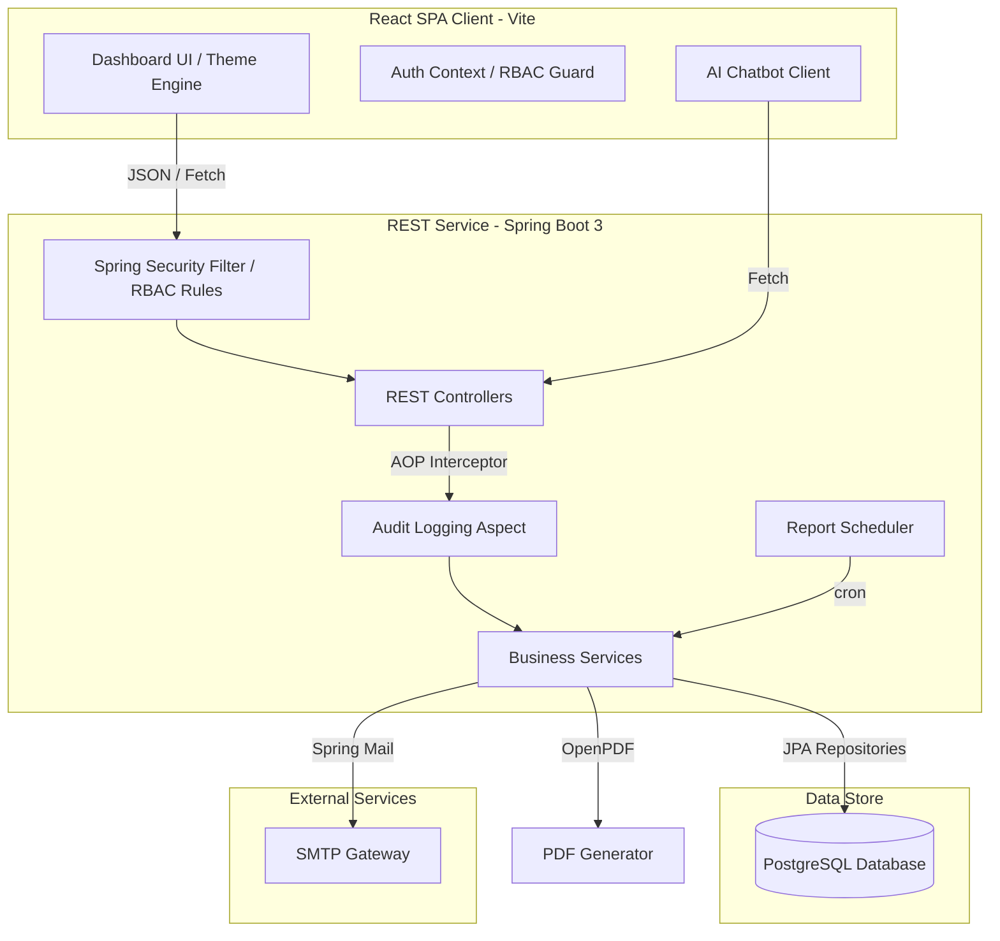

# SentinelCore-SecureOps Enterprise Dashboard

SentinelCore-SecureOps is a production-grade SecOps orchestration platform designed to enable Security Operation Centers (SOCs) to monitor, manage, and mitigate security threats, compliance issues, and infrastructure metrics in real time. It features a modern, responsive React Single Page Application (SPA) frontend integrated with a secure, aspect-audited Spring Boot 3 Java backend and a PostgreSQL database.

---

## 🚀 Key Features

*   **Executive Dashboard**: Real-time aggregation of key security metrics including total enrolled assets, active incident tick counters, critical vulnerability CVE counts, security alerts, and audit records.
*   **Asset Management**: Full CRUD capability for tracking endpoints, databases, servers, and network firewalls, with unique IP address validation and real-time interface metrics (CPU, Memory, Disk, and Network telemetry).
*   **Incident Response Queue**: Detailed incident workflows with custom ticket codes (e.g. `INC-889`), severity scaling (Critical, High, Medium, Low), SLA monitoring, technician assignments, and status updates (Open, Investigating, Resolved).
*   **Vulnerability Tracking**: Repository of active CVE vulnerability logs coupled with specific remediation instructions and automated patch deployment actions.
*   **Compliance Posture Management**: Operational readiness audit dashboard backing standards like ISO/IEC 27001:2022, SOC 2 Type II, and PCI DSS v4.0.
*   **Audit Logger (Spring AOP)**: Passive audit tracing powered by Aspect-Oriented Programming (AOP). Truncates host User-Agent strings dynamically to prevent DB buffer runs.
*   **AI Chatbot Assistant**: Interactive sidebar assistant that analyzes natural queries (e.g., "how do I add a new asset?") and guides users through dashboard views.
*   **Automated Document Reports**: PDF template builder using OpenPDF, complete with scheduled execution trackers (`ReportScheduler`).
*   **SMTP Mail Operations**: Email notifier for system alerts and critical incident updates.

---

## 🛠️ System Architecture



---

## 💻 Tech Stack

### Backend
*   **Framework**: Spring Boot 3.4.7
*   **Language**: Java 17
*   **Security & Auth**: Spring Security 6 (Custom User Details Service, `@PreAuthorize` authorization guards)
*   **Database Integration**: Spring Data JPA & Hibernate
*   **Relational Database Engine**: PostgreSQL
*   **Aspect Auditing**: Spring AOP
*   **Notification Engine**: Spring Mail Starters
*   **Document Generation Engine**: OpenPDF (v2.0.3)

### Frontend
*   **Framework**: React (using Vite)
*   **Routing**: React Router DOM (Declarative Router)
*   **Global Stores**: React Context API (`AuthContext`)
*   **Visual Aesthetics**: Sleek dark theme, responsive grid layouts, and custom micro-animations built using vanilla CSS
*   **UI Alerts**: SweetAlert2 (denied authorizations) & modern toast notification containers

---

## 🔐 Security & Role-Based Access Control (RBAC)

SentinelCore implements a granular authorization engine assigning operations to specfic permissions. The application defines **nineteen distinct permissions** mapping to **nine enterprise operational roles**.

### Permissions Outline
*   **Logins & Auditing**: `AUDIT_VIEW`
*   **User Administration**: `USER_MANAGE`, `ROLE_ASSIGN`
*   **Asset Management**: `ASSET_VIEW`, `ASSET_CREATE`, `ASSET_EDIT`, `ASSET_DELETE`
*   **Incident Management**: `INCIDENT_VIEW`, `INCIDENT_CREATE`, `INCIDENT_MANAGE`, `INCIDENT_RESOLVE`, `INCIDENT_DELETE`
*   **Threat Intel & Telemetry**: `SERVER_RESTART`, `CLUSTER_SCALE`, `CLOUD_MODIFY`, `VULN_MANAGE`, `COMPLIANCE_VIEW`
*   **Reporting & Settings**: `REPORT_EXPORT`, `SETTINGS_ACCESS`, `INTEGRATION_CONFIG`

### Roles Setup
1.  **ROLE_SUPER_ADMIN**: Superuser overriding all permission locks (holds all permissions).
2.  **ROLE_ADMIN**: Administrative credentials block (holds core configurations & user management).
3.  **ROLE_SOC_MANAGER**: Incident tracking oversight (holds `ASSET_VIEW`, `INCIDENT_*`, `REPORT_EXPORT`, `AUDIT_VIEW`).
4.  **ROLE_SECURITY_ANALYST**: Threat detection workflows (holds `ASSET_VIEW`, `INCIDENT_VIEW/CREATE/MANAGE`, `VULN_MANAGE`, `REPORT_EXPORT`).
5.  **ROLE_INCIDENT_RESPONDER**: On-call ticket remediation (holds `ASSET_VIEW`, `INCIDENT_VIEW/MANAGE/RESOLVE`, `AUDIT_VIEW`).
6.  **ROLE_INFRA_ENGINEER**: Hardware telemetry coordinator (holds `ASSET_VIEW/CREATE/EDIT/DELETE`, `INCIDENT_VIEW`, `SERVER_RESTART`, `CLUSTER_SCALE`, `CLOUD_MODIFY`, `REPORT_EXPORT`).
7.  **ROLE_DEVSECOPS**: Continuous compliance configurations (holds `ASSET_VIEW/CREATE/EDIT`, `INCIDENT_VIEW/CREATE/MANAGE`, `VULN_MANAGE`, `SERVER_RESTART`, `CLUSTER_SCALE`, `REPORT_EXPORT`).
8.  **ROLE_AUDITOR**: External compliance auditing (holds `ASSET_VIEW`, `INCIDENT_VIEW`, `AUDIT_VIEW`, `COMPLIANCE_VIEW`, `REPORT_EXPORT`).
9.  **ROLE_VIEWER**: Read-only display credentials (holds `ASSET_VIEW`, `INCIDENT_VIEW`).

### Default Bootstrap Credentials
At application initialization, the system automatically checks for the primary supervisor account and seeds default database roles.

*   **Username**: `admin`
*   **Password**: `admin123`
*   **Role**: `ROLE_SUPER_ADMIN`

---

## 🗄️ Database Models (JPA Entities)

*   `User`: Repositories details on platform accounts, local profile styles (`theme`, `language`, `timezone`), last logins, and active state flags.
*   `Role`: Roles assigned to platform accounts (associated with permissions).
*   `Permission`: Singular access tags validating endpoint security authorization.
*   `Asset`: Hardware registries holding network telemetry details, IP allocations, and host states.
*   `Incident`: Event log capturing security triggers with severity indices, SLA limits, and technician owners.
*   `Vulnerability`: Open CVE listings containing host correlations and remediation references.
*   `AuditLog`: Auto-generated action footprints triggered by `@Auditable` controller checkpoints.
*   `Alert`: Real-time system notifications showing source files and severity flags.

---

## 📡 API Endpoint Reference

| Endpoint | Method | Required Authority | Description |
| :--- | :--- | :--- | :--- |
| `/api/users/register` | `POST` | Public | Enrolls a new system user profile. |
| `/api/users` | `GET` | `USER_MANAGE` | Retrieves system user metadata. |
| `/api/users/{id}/role` | `PUT` | `ROLE_ASSIGN` | Changes a user's operational role. |
| `/api/users/{id}/disable` | `PUT` | `USER_MANAGE` | Enables or disables an active user registry. |
| `/api/users/{id}/reset-password` | `PUT` | `USER_MANAGE` | Performs an administrative password reset. |
| `/api/users/profile` | `PUT` | Authenticated | Updates current user's profile card. |
| `/api/assets` | `GET` | `ASSET_VIEW` | Fetches active asset registry list. |
| `/api/assets/{id}` | `GET` | `ASSET_VIEW` | Fetches a target asset details. |
| `/api/assets` | `POST` | `ASSET_CREATE` | Registers a new asset host configuration. |
| `/api/assets/{id}` | `PUT` | `ASSET_EDIT` | Edits asset configuration parameters. |
| `/api/assets/{id}` | `DELETE` | `ASSET_DELETE` | Retires a network asset from the platform. |
| `/api/dashboard/stats` | `GET` | Authenticated | Aggregates scorecard metrics. |
| `/api/dashboard/incidents/status`| `GET` | Authenticated | Aggregates status counts (open/investigating/etc.).|
| `/api/dashboard/incidents/severity`| `GET` | Authenticated | Aggregates severity counts (critical/high/etc.). |
| `/api/dashboard/incidents/trend` | `GET` | Authenticated | Fetches incident trends tracking points. |
| `/api/dashboard/incidents/recent`| `GET` | Authenticated | Fetches recent incident logs. |
| `/api/dashboard/alerts/recent` | `GET` | Authenticated | Fetches recent real-time system alerts. |
| `/api/dashboard/audit-logs/recent`| `GET` | Authenticated | Fetches recent audit trails. |
| `/api/dashboard/user` | `GET` | Authenticated | Returns current session user DTO. |
| `/api/ai/chat` | `POST` | Public | Sends message to AI SecOps Assistant. |

---

## ⚙️ Installation & Run Guide

### Infrastructure Setup
Ensure that local database server dependencies are running.

1.  **PostgreSQL Database**:
    *   Create a local database named `sentinelcore`.
    *   By default, the server expects connection coordinates to match:
        *   **Host**: `localhost:5432`
        *   **User**: `postgres`
        *   **Password**: Update `spring.datasource.password` in application settings config or provide appropriate environment credentials.

### Starting Backend Server (8081)
The backend uses Maven for packaging and dependency retrieval, running on port `8081`.

1.  Navigate to the `backend/` subdirectory:
2.  Run the application locally using Maven:
    ```bash
    mvnw.cmd spring-boot:run
    ```
    *Or use the pre-packaged run executable:*
    ```bash
    run-server.bat
    ```
3.  The backend will bootstrap the database, insert default roles, seed initial records, and deploy the administrative account properties.

### Starting Frontend Server (5173 / Localhost)
The client frontend is built on React using Vite.

1.  Navigate to the `frontend/` subdirectory:
    ```bash
    cd frontend
    ```
2.  Install required dependencies:
    ```bash
    npm install
    ```
3.  Launch the development watcher proxy:
    ```bash
    npm run dev
    ```
4.  Open your browser and navigate to the port output (usually `http://localhost:5173`).
5.  Sign in using the bootstrap credentials (`admin` / `admin123`).